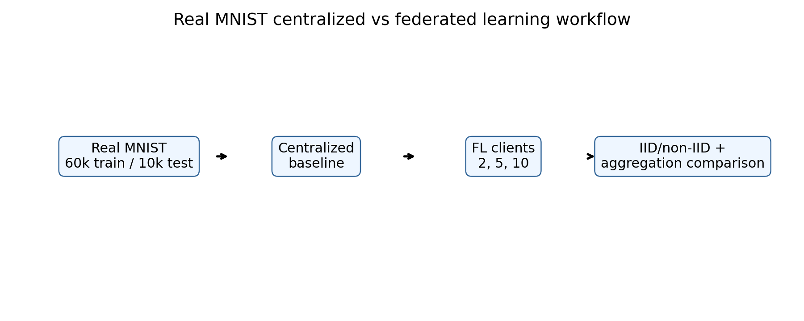
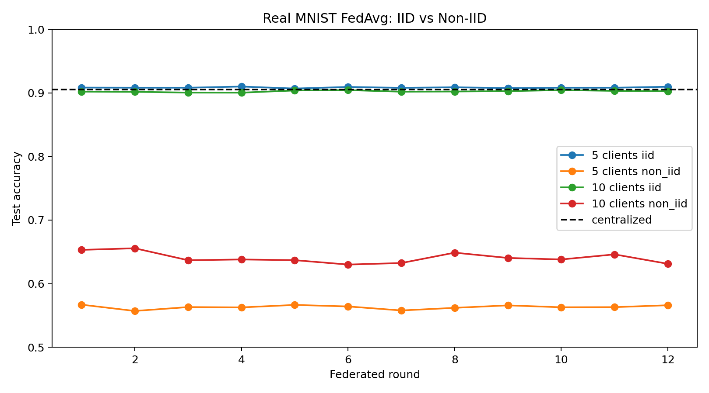
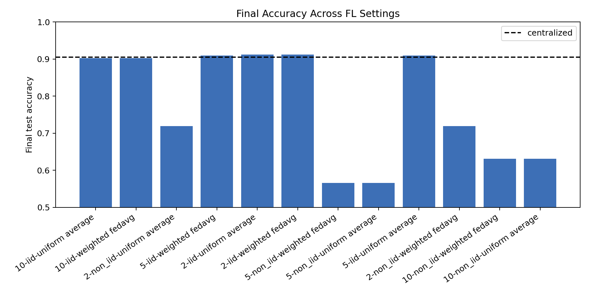

# MNIST Federated Learning: Centralized vs FL



Figure: real MNIST is evaluated with a centralized baseline and multiple federated learning settings.

## Motivation

Federated learning should be compared against centralized training and tested under different client settings. A single FL run is not enough because performance changes with the number of clients, IID versus non-IID data, and aggregation strategy.

## Project Goal

We trained a real MNIST digit classifier and compared:

- Centralized training
- Federated learning with 2, 5, and 10 clients
- IID and non-IID client splits
- Weighted FedAvg and uniform averaging

## Dataset

We used the real MNIST IDX files.

- Training images: 60,000
- Test images: 10,000
- Classes: 10 digits
- Image size: 28x28 grayscale

The raw data is downloaded into `data/`, which is ignored by Git.

## Tools

Python, NumPy, pandas, scikit-learn, and matplotlib.

## Method

The model is a multinomial logistic classifier trained with SGD. In the centralized baseline, one model trains on all 60,000 training images.

In federated learning, each client trains locally for one local step per round. The server aggregates local model parameters after every round. We ran 12 federated rounds.

Aggregation methods:

- Weighted FedAvg: average client parameters by client sample count
- Uniform averaging: average clients equally

In this experiment, client sizes are equal, so weighted and uniform averaging produce the same final values. The code keeps both methods because they differ when client sizes are unequal.

## Hyperparameters

| Setting | Value |
|---|---:|
| Rounds | 12 |
| Client counts | 2, 5, 10 |
| Local model | SGD logistic regression |
| Learning rate | 0.02 |
| Aggregations | Weighted FedAvg, uniform average |
| Splits | IID, non-IID |
| Random seed | 42 |

## Results

Centralized baseline:

| Model | Accuracy |
|---|---:|
| Centralized SGD logistic | 0.9051 |

Final federated results:

| Clients | Split | Aggregation | Final Accuracy |
|---:|---|---|---:|
| 2 | IID | Weighted FedAvg | 0.9121 |
| 5 | IID | Weighted FedAvg | 0.9097 |
| 10 | IID | Weighted FedAvg | 0.9027 |
| 2 | Non-IID | Weighted FedAvg | 0.7192 |
| 5 | Non-IID | Weighted FedAvg | 0.5660 |
| 10 | Non-IID | Weighted FedAvg | 0.6312 |





Result files:

- `results/centralized_baseline.csv`
- `results/federated_round_metrics.csv`
- `results/final_comparison.csv`
- `results/client_label_distribution.csv`
- `results/experiment_setup.csv`

## Interpretation

IID federated learning performs close to centralized training. This means FedAvg works well when every client has a balanced view of the digit classes.

Non-IID federated learning is much harder. Clients see label-skewed data, so their local updates point toward different class subsets. This hurts the global model, especially with 5 clients in this setup.

The comparison shows the main lesson of federated learning: the algorithm is not only about averaging weights. The client data distribution strongly controls the result.

## Conclusion

This project uses real MNIST and compares centralized learning, IID FL, non-IID FL, different client counts, and aggregation methods. The strongest result is that IID FL can match centralized performance, while non-IID FL degrades significantly.

## How To Run

```bash
pip install -r requirements.txt
python 1_real_mnist_federated_comparison.py
```
